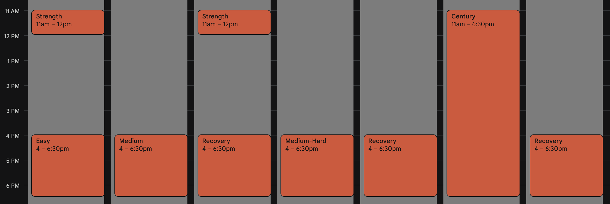

After realizing my Goblin route is fine for all my riding as a [shameless suburban sprinter](../Shameless%20suburban%20sprinter.md) I can do it anytime of the day or night or week due to how safe and consistent the traffic is, I realized I can add the Saturday century ride as a weekly thing and also add lunchtime [strength and core training](../Strength%20and%20core%20training.md) a couple days a week, forever.

The Saturday century is just to promote all the other factors that prevent long rides and keep my nutrition strategy dialed in.

The volume might seem high and unrealistic to others but it really isn't compared to what adventure cyclists do on the daily. Again, I'm not doing this to beat anyone else. I'm doing it because I love it.

I also don't have a lot going on in my life at the moment and I kind of like it that way. It's not like it was when I had a family to race, business of my own to build, or even livestream community to keep satisfied. It's just me doing what makes be supremely content. Isn't that what retirement is supposed to be about? My simple daily routine keeps me so filled with joy on the daily that very few other things in life phase me or attract me. I *never* want this feeling to go away. In fact, I'm feeling rather protective of it at this point.

I had some asshole say I had "too much time on my hands" just for shopping in the middle of the day during the power outage and getting a free chicken. I had to just shake my head. What a clueless, sad, pathetic existence that person must have. The best part was how silly it sounded to me immediately. All the other commenters where very positive and laughed. But that is how life and people are, some really sad, bad ones, and a ton of great ones. I see them every single day and I couldn't be happier w