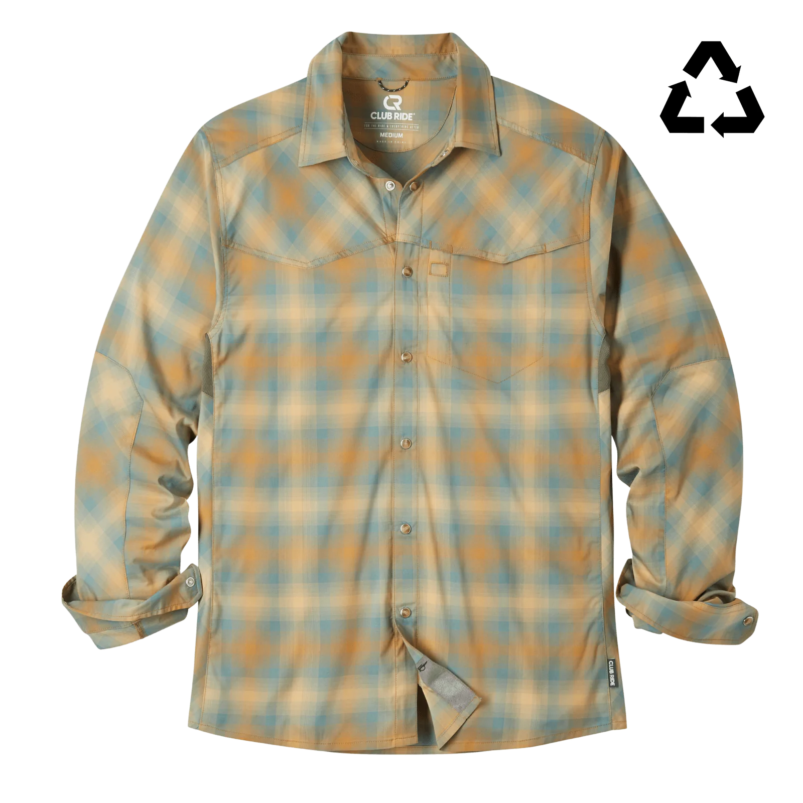

*I only wear this on the mountain bike these days or when off the bike.*

The Club Ride Go Long Western shirt is the most amazing cycling shirt I've ever owned. Club Ride has long been my #1 favorite in cycling apparel but after a three-hour ride in this "sun" shirt I cannot overstate just how dialed in this company is to the cycling values that I share.

For me, the key to having fun on _most_ rides is comfort and freedom, to move or not move and get a coffee. Even though I love swapping in my aero road wheel-set and doing a little Strava CR/KOM hunting while in my Lycra super hero outfit (usually from NeoPro), I spend 80% of my time on the bike doing relatively slow base building zone 2, long-haul adventure cycling, or flowing over gorgeous MTB trails. This shirt gets that vibe perfectly.

Honestly, I don't know how they do it. They even managed to make a sun shirt that never feels clammy and sticky when you sweat in it (like every single sun shirt Patagonia makes). It also doesn't have the stiffness and tendency to wrinkle horribly like the traditional "fly fishing" shirts. It's simply perfect. It's so comfortable and effective you don't need a sweat-wicking sleeveless undershirt but you could add one.

Even the branding on this shirt is perfect, hiding it on the rear shoulder making it way more understated. The western pattern with flap covered pocket looks great and keeps those pocket from filling up with air while riding. I'd feel totally comfortable wearing this to an art opening with Doris.  The medium slim fit is the perfect balance between Lycra tight, showing every caloric mistake I made over Winter, and too much drag. I mean, it looks really great on or off the bike.

They even included a perfect zippered pocket for a snack and a built in cloth to clean my glasses. I freaking love this shirt. I just wish they had it in more than only two colors.

https://www.clubrideapparel.com/products/mens-go-long-long-sleeve-shirt?variant=41311081201735

