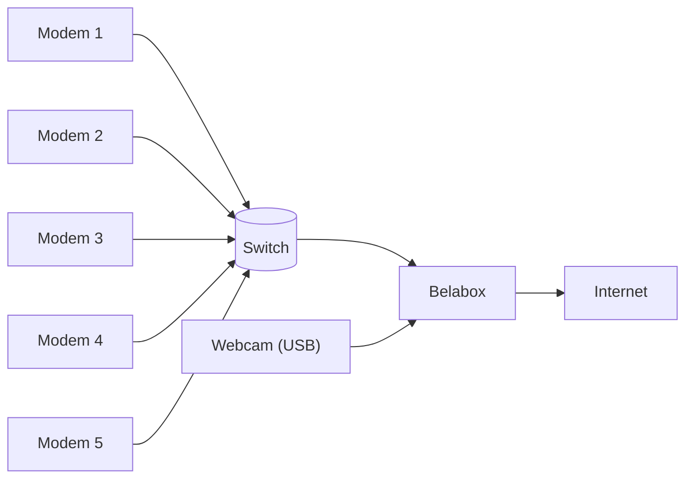

The key is to keep as much power available to the Belabox device as possible so the CPU isn't starved while trying to do all its rendering. This is why, for example, that having the Belabox device do HDMI encoding is never really a good idea and why DJI dominates the webcam options because it has stabilization in webcam mode where the encoding is done on the camera itself.

