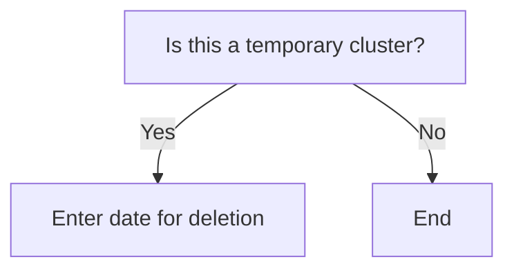

[Leave Obsidian running at home to sync to GitHub automatically from the road](Knowledge%20management/Leave%20Obsidian%20running%20at%20home%20to%20sync%20to%20GitHub%20automatically%20from%20the%20road.md)
