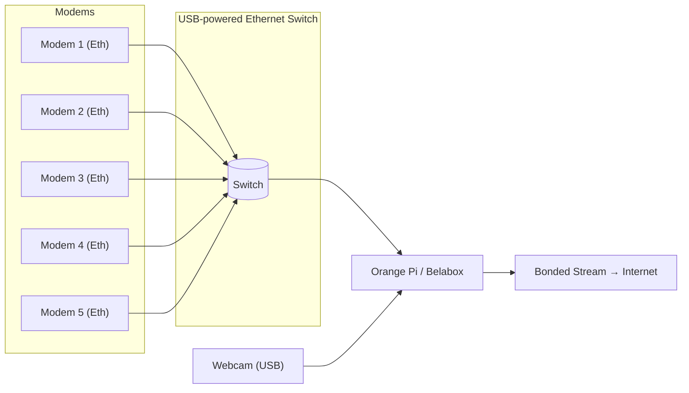

```mermaid
flowchart LR
  subgraph Modems
    M1["Modem 1 (Eth)"]
    M2["Modem 2 (Eth)"]
    M3["Modem 3 (Eth)"]
    M4["Modem 4 (Eth)"]
    M5["Modem 5 (Eth)"]
  end

  subgraph SwitchBox["USB-powered Ethernet Switch"]
    SW[(Switch)]
  end

  M1 --> SW
  M2 --> SW
  M3 --> SW
  M4 --> SW
  M5 --> SW

  SW --> BELA["Orange Pi / Belabox"]
  CAM["Webcam (USB)"] --> BELA
  BELA --> Cloud["Bonded Stream → Internet"]
```
