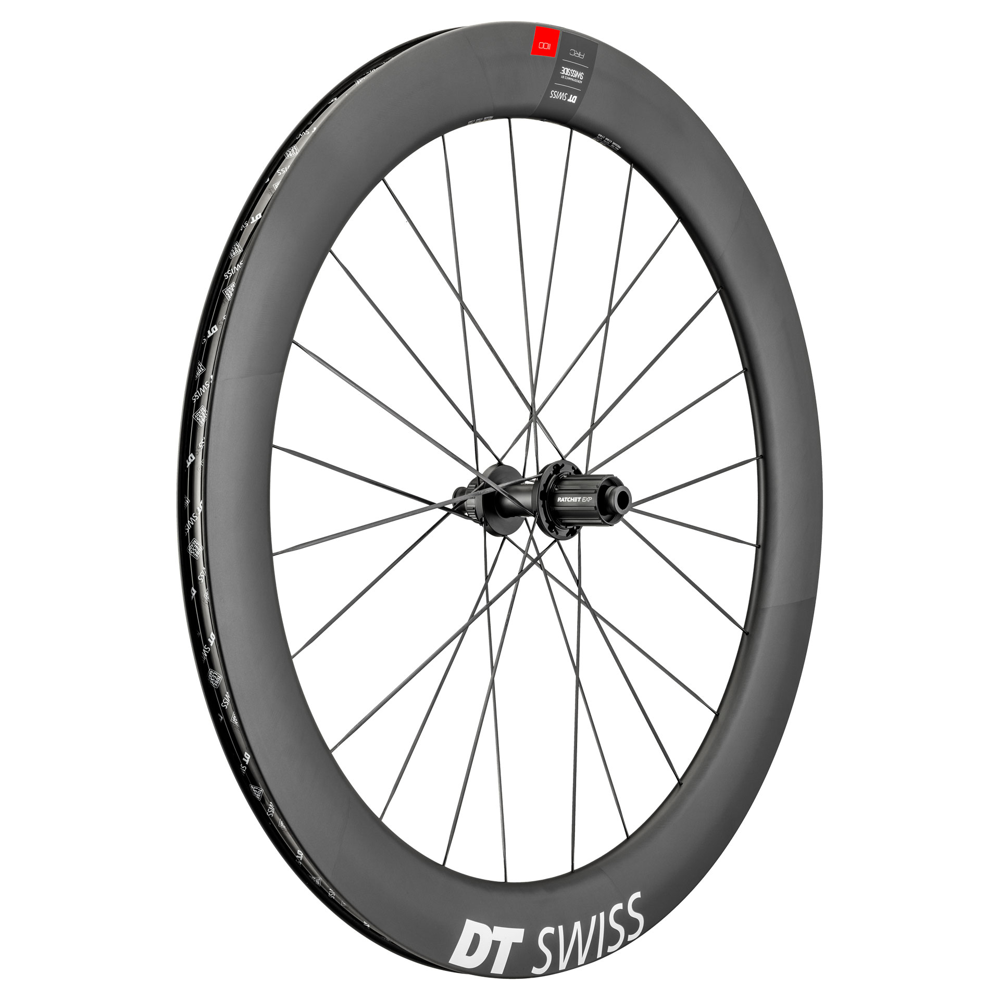

- [Best wheels better than best bike](Best%20wheels%20better%20than%20best%20bike.md)

Eventually, I'm going to get the best all-around wheel-set money can buy. These wheels will cost much more than the road bike I currently have but they will hold up in value over time as I get different road bikes. Based on my style of riding, here's what I think are the best all-around road wheels are for the events I regularly plan on doing:

- DT Swiss ARC 1100 DICUT db 62 (65 is UCI max depth)
- Continental Grand Prix 5000 S TR 28c

I looked seriously at the Specialized Rovals but the DT Swiss are just plain better for performance and—let's face it—prettier.

## Earning them with fitness

I'm rewarding myself with these as soon I reach my [cycling goals](Cycling%20goals.md) (which will take about a year). Paying $3000 for wheels is kind of a waste before that. That way I have something to work for, sort of like a Zwift challenge but for real. Once my fitness and skills are back up to snuff, the single biggest thing slowing me down will be my clothes and wheels.

